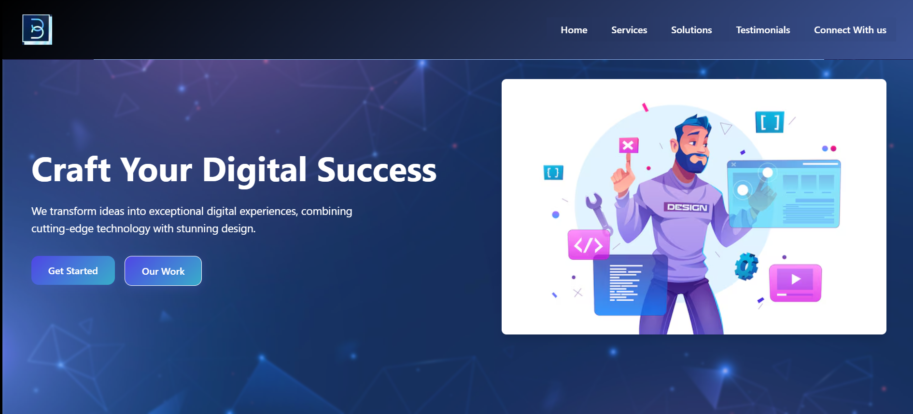
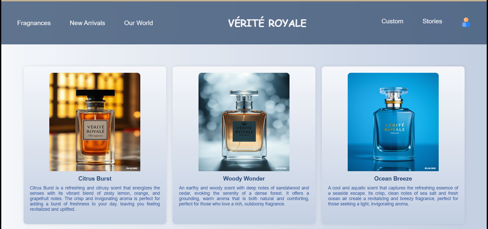
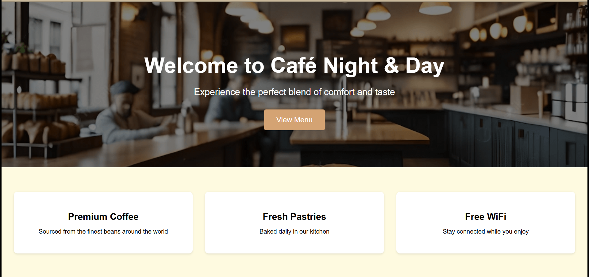
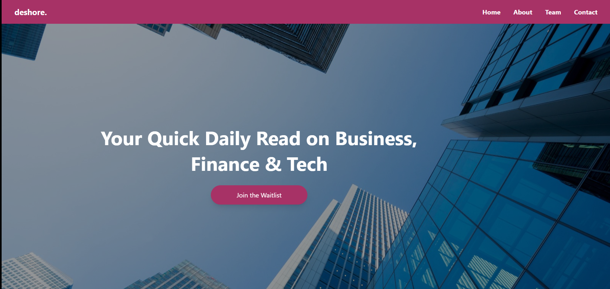

# Yavya Sharma - Portfolio

Welcome to my portfolio! This repository showcases my professional journey as a Full Stack Developer with expertise in web development, digital marketing, and custom software solutions. Feel free to explore and connect with me if you have any questions or collaboration ideas.

## 🛠️ Projects

Here's a summary of the key projects in this portfolio:

### [Byte Sphere Digital](https://bytespheredigital.com)
- **Description**: A cutting-edge digital solutions company specializing in web development, digital marketing, and custom software solutions.
- **Technologies**: React, Angular, Node.js, Cloud Technologies
- **Features**: Responsive web design, strategic digital marketing campaigns, scalable and secure solutions
- **Link**: [Visit Website](https://bytespheredigital.com)
- **Screenshots**: 

### [VÉRITÉ ROYALE](https://verite-royale.netlify.app/)
- **Description**: A luxury perfume brand e-commerce website that embodies the essence of bespoke beauty.
- **Technologies**: HTML/CSS, JavaScript, React
- **Features**: Product showcase, luxury brand identity, responsive design
- **Link**: [Live Demo](https://verite-royale.netlify.app/)
- **Screenshots**: 

### [Night & Day Cafe & Mart](https://night-day-cafe-face.onrender.com/)
- **Description**: A neighborhood cafe and mart website that provides services day and night.
- **Technologies**: HTML/CSS, JavaScript, React
- **Features**: Menu showcase, online ordering, business information
- **Link**: [Live Demo](https://night-day-cafe-face.onrender.com/)
- **Screenshots**: 

### [Deshore](https://deshore.in)
- **Description**: A tech company specializing in short-format informational content.
- **Technologies**: HTML/CSS, JavaScript, Content Management
- **Features**: News stories, hyperlocal updates, user content preference
- **Link**: [Live Demo](https://deshore.in)
- **Screenshots**: 

## 📚 Skills

I am proficient in the following areas:

Languages: [e.g., Python, JavaScript, HTML/CSS]
Frameworks/Libraries: [e.g., React, Django, Express]
Tools & Technologies: [e.g., Git, Docker, AWS]
💡 About Me
I’m [Your Name], a [Your Role/Title, e.g., Full Stack Developer] with a passion for [Your Interests or Specializations, e.g., creating user-friendly web applications]. I have experience in [Brief Summary of Your Experience or Background].

🌟 Highlights
[Highlight 1: Achievement, certification, or notable skill]
[Highlight 2: Award, project milestone, or significant contribution]
📞 Get in Touch
I’m always open to discussing new projects, collaborations, or opportunities. You can reach me at:

- **Email**: yavya.sharma21@gmail.com
- **LinkedIn**: [Yavya Sharma](https://www.linkedin.com/in/yavya-sharma-863225165)
- **GitHub**: [devYavya](https://github.com/devYavya)
- **Website**: [My Portfolio](https://yavyasharma.netlify.app)

## 🚀 Portfolio Details

This portfolio was built using:
- HTML5
- CSS3
- JavaScript
- Responsive Design
- Boxicons for icons

## 📝 License

This portfolio is licensed under the MIT License. See the LICENSE file for more details.

